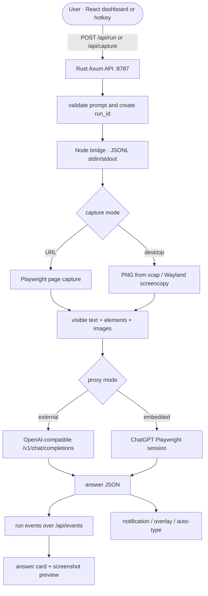
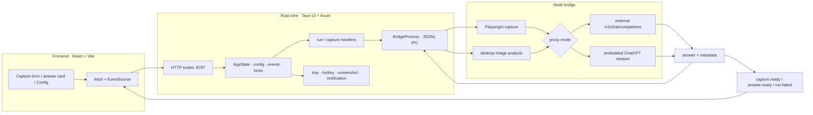
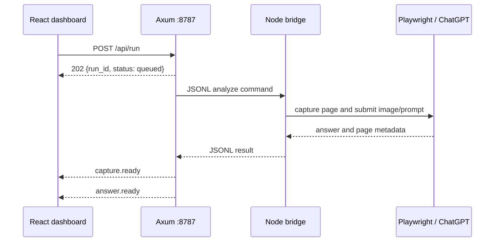
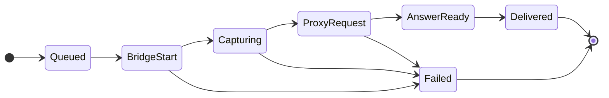
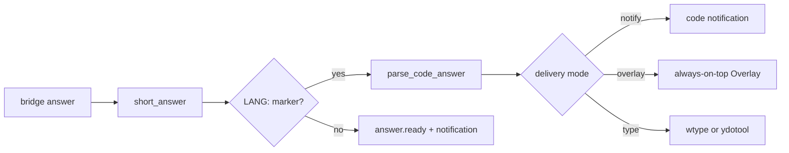
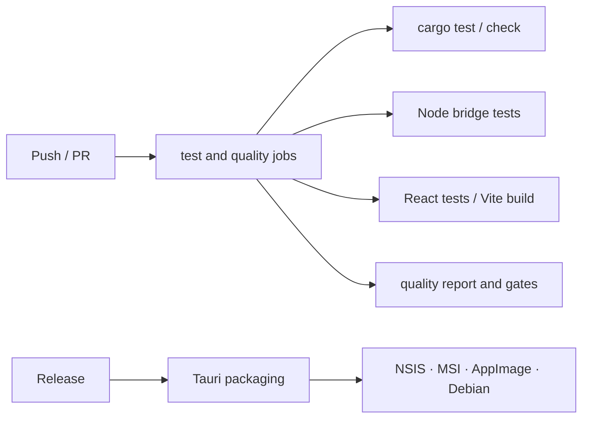
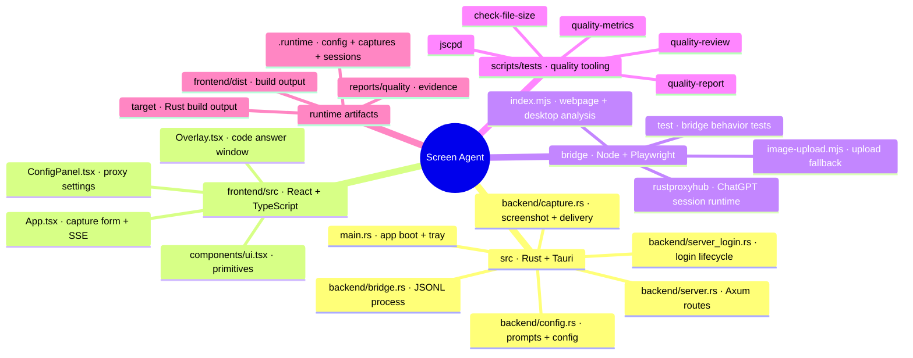

<div align="center">

<h1 align="center">
  Screen Agent
</h1>

A local-first desktop agent that captures a webpage or desktop screen, sends the screenshot and visible context through an OpenAI-compatible proxy, streams lifecycle events over SSE, and delivers answers as notifications, an always-on-top overlay, or typed code. Built on Tauri v2 (Rust) + React + Node/Playwright.

<p align="center">
  
  
  
  
  
</p>

**English**

</div>

---

<h1 align="center">
  
  Demo | Command Center
</h1>

```
 Screen Agent v0.1.0                         api: http://127.0.0.1:8787

 ──────────────────────────────────────────────────────────────────────
   Capture target                         ● bridge ready   ● local API
 ──────────────────────────────────────────────────────────────────────
   URL  https://example.com
   Prompt  Read this page and answer the question in one crisp paragraph.
 ──────────────────────────────────────────────────────────────────────
   [ Read screen ↗ ]       [ Config ]       status: Ready
 ──────────────────────────────────────────────────────────────────────
   Answer
   Screenshot captured · Local image · Local context
   Your answer lands here after the bridge returns.
```

---

<h1 align="center">
   Supported Flows
</h1>

| Flow | Runtime | Input | Output |
|---|---|---|---|
| **Webpage analysis** | Node + Playwright | URL, prompt, web-search flag | Screenshot, visible text, elements, images, answer |
| **Desktop capture** | Rust `xcap` / Linux Wayland screencopy | Global shortcut or `POST /api/capture` | Primary-monitor screenshot and answer events |
| **Embedded ChatGPT** | Persistent Playwright profile | Local login session | Browser-backed text and image analysis |
| **External proxy** | OpenAI-compatible HTTP | `POST /v1/chat/completions` | Proxy answer with inline PNG data |
| **Answer delivery** | Rust platform adapters | Parsed `LANG:` code answer | Notification, Overlay, or Linux auto-type |

The app does not claim to be a multi-provider gateway. Current embedded bridge handlers target the ChatGPT web session; external proxy mode remains configurable through the UI.

---

<h1 align="center">How It Works</h1>



---

<h1 align="center">
   Features
</h1>

* **One small desktop surface**: React dashboard, Rust API, browser bridge, and OS integrations live in one Tauri app.
* **Webpage context capture**: records viewport, page title, visible body text, interactive elements, image inventory, and a PNG screenshot.
* **Desktop screenshot mode**: hotkey capture uses `xcap`; Linux Wayland first tries `wlr-screencopy` through `libwayshot-xcap`.
* **Embedded login flow**: open a visible ChatGPT login window, wait for a real session, persist Playwright storage state, and reuse it later.
* **External proxy mode**: set a Hub URL and optional API key; screenshots are sent as inline `data:image/png;base64,...` content.
* **SSE lifecycle events**: `/api/events` publishes queued, capture, answer, and failure state.
* **Code-aware delivery**: `Short Answer:` and `LANG:` markers let Rust extract complete code and route it to notification, Overlay, or auto-type.
* **Optional image-host fallback**: Catbox, ImgPile, Postimages, ImgBB, and ImgLink can be tried in configured order; uploads stay disabled by default.
* **Local configuration**: runtime config is persisted locally, secrets are write-only in the public API, and Unix config files receive mode `0600`.
* **Wayland-aware shortcut support**: Hyprland can register a compositor bind that calls the local capture endpoint.
* **Persistent bridge discipline**: a runtime lock prevents profile collisions; bridge requests use bounded timeouts and one retry.

---

<h1 align="center">
   What It Saves You
</h1>

Screen Agent removes repeated screenshot, prompt, browser-session, and answer-delivery work. These are workflow savings visible in the implementation, not end-to-end speed claims.

| Work normally repeated | Screen Agent path | What it saves |
|---|---|---|
| Copy a screenshot into an AI chat | Hotkey or `POST /api/capture` | Manual screenshot, file selection, and upload steps |
| Rebuild page context by hand | Playwright extracts text, elements, and images | Repeated context copying |
| Open a browser session for every run | Persistent embedded profile | Repeated login and session setup |
| Support different proxy choices | One config panel with embedded or external mode | Per-run environment editing |
| Watch a long-running request | SSE events and answer state cards | Polling and blind waiting |
| Deliver generated code | `notify`, `overlay`, or `type` modes | Copy/paste into an editor |
| Debug capture failures | Saved PNGs, viewport metadata, bridge stderr, and run IDs | Manual reproduction and log hunting |
| Keep browser automation in the UI | Rust owns lifecycle; Node owns Playwright | Cross-layer process coordination |

---

<h1 align="center">
   The Benefits of the Project
</h1>

### What it serves

Screen Agent solves a common context-switching problem: useful information is visible on a screen, but turning it into an AI request usually means taking a screenshot, copying text, describing the page, opening a browser session, and then copying the answer back into the work surface. The project compresses that whole loop into one explicit capture action.

### Why you should try it

- **One action starts the workflow**: use the dashboard or a global hotkey instead of rebuilding context by hand.
- **Context stays inspectable**: the answer includes the screenshot preview, page metadata, visible elements, image inventory, and lifecycle state.
- **Local control comes first**: runtime state stays on the machine; external proxy use is a deliberate configuration choice.
- **Existing browser access remains useful**: embedded ChatGPT mode reuses a persistent session instead of requiring another provider integration.
- **Code can land where work happens**: choose notification, Overlay, or Linux auto-type delivery.
- **Failures stay visible**: bridge errors, missing login, timeouts, and run IDs appear as explicit events instead of silent background work.

### Real problem solved

The project targets repetitive, error-prone context transfer. It is useful for someone who repeatedly needs to understand a webpage, inspect a screenshot, solve a visible coding task, or turn a captured screen into a concise answer. It is not a replacement for judgement: the user chooses the target, prompt, proxy, and final delivery path.

---

<h1 align="center">
   Metrics
</h1>

Every action the agent performs replaces one you would otherwise do by hand. The numbers below are conservative per-task estimates after one-time setup and login. The **counts** come from your own runs; the **minutes** describe user busywork and exclude model, network, and browser response latency.

| Task | By hand | With Screen Agent | You save |
|---|---:|---:|---:|
| Capture and save one screenshot | ~1.5 min | ~5 s (hotkey or capture action) | **~94%** |
| Assemble visible page context | ~4 min | 0 (Playwright extracts it) | **100%** |
| Send screenshot, prompt, and context | ~2 min | ~10 s (one queued run) | **~92%** |
| Read and move one code answer into the editor | ~3 min | ~15 s (Overlay or auto-type) | **~92%** |
| Reopen a warm browser session | ~2 min | 0 (persistent profile) | **100%** |

> **A 20-capture week:** ~**3.5 h** of repeated user work by hand → ~**10 min** with the capture workflow. Across the loop — capturing, assembling context, sending, and moving the answer — Screen Agent removes roughly **90–96%** of repetitive user busywork in this estimate. One-time login, model latency, and your judgement remain outside the calculation.

The repository also tracks engineering metrics separately: file size, duplication, complexity, coverage, tests, Git churn, and bridge benchmarks under `reports/quality/`.

---

<h1 align="center">
   Tech Stack
</h1>

<p align="center">
  
</p>

* **Desktop shell**: Tauri v2 with Rust 2021 and the system WebView.
* **Backend**: Rust · `tokio` · `axum` 0.8 · `tower-http` · `serde` · `anyhow` · `tracing`.
* **Capture**: `xcap` on desktop platforms; `libwayshot-xcap` and `image` on Linux Wayland.
* **Frontend**: React 19 · TypeScript 5.7 · Vite 8 · Vitest.
* **Browser bridge**: Node ESM + Playwright 1.60, with ChatGPT session modules under `bridge/rustproxyhub/`.
* **OS delivery**: `notify-rust`, Tauri Overlay window, `wtype` or `ydotool` on Linux.
* **CI/CD**: GitHub Actions for frontend, bridge, Rust, Docker, quality, and release workflows.
* **Packaging**: Tauri resources bundle the `bridge/` directory and icons for NSIS, MSI, AppImage, and Debian targets.

---

<h1 align="center">
  
  Installation & Setup
</h1>

Run commands from repository root:

```bash
pnpm install
pnpm bridge:install
```

### Requirements

- **Rust** stable + Cargo
- **Node.js** and **pnpm**; CI pins Node 24 and pnpm 10.15.0
- A Chromium-family browser available to Playwright or configured through `PLAYWRIGHT_CHROMIUM_EXECUTABLE_PATH`
- Tauri/WebView system dependencies on Linux
- A logged-in ChatGPT browser session when using the embedded proxy
- An external OpenAI-compatible proxy URL when using external mode

For Debian/Ubuntu desktop builds, install the WebKitGTK and Tauri libraries required by your platform image. The included Dockerfile uses a Playwright-compatible Ubuntu Noble base and an Xvfb display for headless operation.

### Run (development)

```bash
# Full desktop app: Vite + Tauri + Rust API
pnpm desktop:dev

# Frontend only
pnpm dev

# Rust API only
pnpm dev:api
```

The frontend runs on `http://localhost:5173`. The Rust API defaults to `http://127.0.0.1:8787`. Blank Hub URL selects the embedded bridge. Open **Config**, choose **Open embedded ChatGPT login**, finish sign-in, then run a capture.

### Build (release)

```bash
# Frontend production build
pnpm build

# Desktop release build
pnpm desktop:build

# Docker headless runtime
docker compose up --build
curl http://127.0.0.1:8787/api/health
```

### Verify (the repository checks)

```bash
cargo test
npm run test:bridge
npm run test:frontend
npm run quality:tests
cargo check
pnpm build
```

The full quality command is:

```bash
pnpm quality
```

It runs quality-script tests, bridge coverage/report generation, the bridge benchmark, file-size checks, duplication checks, complexity checks, and the configured tool gates.

### Duplication metrics

```bash
# Full quality report under reports/quality/
pnpm quality

# Direct wrapper usage
node scripts/tests/jscpd.mjs src bridge/rustproxyhub frontend/src \
  --reporters console,markdown \
  --output reports/quality/jscpd-custom \
  --metrics reports/quality/jscpd-custom/summary.json \
  --min-lines 10 \
  --threshold 5
```

The quality policy treats duplication above 3% as review material and above 5% as a hard gate. Generated reports, dependencies, and build output are excluded from the default source scope.

### Cargo Features

| Feature | Default | Effect |
|---|---|---|
| *(none)* | ✓ | No optional Cargo features. Capture, Tauri, Axum, notifications, and the Node/Playwright bridge are part of the default runtime. |

---

<h1 align="center">
  
  Architecture
</h1>

Screen Agent is a Tauri v2 app. React calls the local HTTP API, Rust owns application state and OS integrations, and a persistent Node process owns browser automation. The Rust side never parses browser DOM directly; it sends JSONL commands to the bridge and receives structured JSON results.



### Real-time streaming (SSE)

The local API exposes one broadcast stream at `/api/events`. Runs return `202 Accepted` immediately; the background task publishes `run.queued`, `capture.ready`, `answer.ready`, or `run.failed` with the same `run_id`.



### API Surface

The dashboard uses the local Rust API. The external proxy, when selected, is an upstream dependency rather than another route hosted by this application.

| Route | Purpose |
|---|---|
| `GET /api/health` | API, bridge, and proxy-mode health |
| `GET /api/config` | Public configuration snapshot; secrets are represented as configured flags |
| `PUT /api/config` | Update proxy, session, upload, hotkey, and delivery settings |
| `POST /api/run` | Queue webpage analysis with `{url, prompt, web_search}` |
| `GET /api/events` | SSE lifecycle stream |
| `POST /api/capture` | Queue desktop screenshot analysis |
| `POST /api/proxy/login` | Open embedded ChatGPT login window |
| `GET /api/proxy/status` | Read embedded or external proxy readiness |
| `POST /api/proxy/close-login` | Close embedded login bridge |
| `GET /captures/<run_id>.png` | Serve saved local capture preview |

### Bridge smoke

```bash
pnpm bridge:smoke
```

The root bridge reads newline-delimited JSON from stdin and writes newline-delimited JSON to stdout. Rust starts it with the runtime path, proxy settings, model, session ID, upload settings, and ChatGPT mode in its environment. Deterministic bridge behavior is covered by `bridge/test/*.test.mjs`.

### Desktop capture smoke

Start the app, then trigger a capture from the configured hotkey or call:

```bash
curl -X POST http://127.0.0.1:8787/api/capture
curl http://127.0.0.1:8787/api/health
```

Subscribe to `/api/events` to observe the run and open the returned `/captures/<run_id>.png` path through the frontend proxy.

### Tool-path benchmarks

```bash
pnpm benchmark
```

The benchmark exercises the bridge parser and helper paths. It is a local measurement of bridge behavior, not provider latency, browser startup time, or model throughput.

### Request lifecycle (state machine)

The dashboard follows explicit runtime events. A missing embedded session short-circuits to a login prompt instead of producing a silent local answer.



### Answer parsing — one shared path

All successful bridge results pass through the same Rust delivery path. `Short Answer:` selects the concise answer. A `LANG:` line followed by code becomes a code payload. Code goes to the configured `notify`, `overlay`, or `type` delivery mode; regular answers go to a desktop notification.



### Quality Metrics

The quality tooling produces local evidence under `reports/quality/`:

| Metric family | Type | Measures |
|---|---|---|
| File size | gate/review | Physical source lines and oversized files |
| JSCPD | percentage | Duplicate lines, tokens, and clones |
| Lizard | gate/review | NLOC, cyclomatic complexity, parameters, nesting |
| Coverage | report | LCOV, Cobertura, or JaCoCo-derived line metrics |
| Tests | report | JUnit/Node test totals, failures, errors, skipped cases |
| Churn | hotspot | Git changes combined with source size |
| Bridge benchmark | JSON | Bridge iterations, elapsed time, and operations/second |

Default policy: file review at 401 lines, hard failure above 800; duplication review above 3%, hard failure above 5%; minimum line coverage 80% when evidence is available.

---

<h1 align="center">
   GitHub Actions CI/CD
</h1>

### Workflow Matrix

| Workflow | Trigger | Main checks |
|---|---|---|
| `ci.yml` | push / pull request | Rust checks, frontend build/test, bridge tests |
| `code-quality.yml` | push / pull request | ESLint, duplication, complexity, quality report |
| `docker.yml` | image changes | Docker build and runtime validation |
| `release.yml` | release/tag flow | Tauri packaging and platform artifacts |



> One contract covers the three runtime layers: Rust, frontend, and bridge. Release packaging includes the `bridge/` resource tree used by the desktop app.

---

<h1 align="center">
   Project Structure
</h1>



---

<h1 align="center">
   IT-Management Objectives → Metrics
</h1>

> The project demonstrates operational objectives through inspectable code, tests, reports, and runtime events. Claims stay tied to repository artifacts.

| # | Objective | How Screen Agent delivers it | Verifiable artifact |
|---|---|---|---|
| 1 | **Look at the business** | One capture workflow turns screen context into an actionable answer | `App.tsx` + `/api/run` |
| 2 | **Measure service health** | Health, SSE lifecycle, bridge status, and run IDs expose state | `/api/health`, `/api/events` |
| 3 | **Reduce repeated work** | Persistent browser profile and saved config reduce setup steps | `chatgpt-session-runtime.mjs`, `config.rs` |
| 4 | **Maintain internal service levels** | Bounded login, request, screenshot, and shutdown timeouts | `bridge.rs`, `server_login.rs` |
| 5 | **Control operating cost** | Local-first execution and optional image uploads avoid mandatory relay infrastructure | `README.md`, `docker-compose.yml` |
| 6 | **Optimize structure** | Rust owns lifecycle; Node owns browser automation; React owns presentation | Architecture diagram above |
| 7 | **Be agile** | External and embedded proxy modes share one UI contract | `ConfigPanel.tsx`, `config.rs` |
| 8 | **Innovate in proposed solutions** | Desktop capture, visible DOM extraction, and code delivery share one run model | `capture.rs`, `bridge/index.mjs` |
| 9 | **Generate correct information** | Structured metadata, bounded text extraction, response parsing, and explicit errors | `capture_event_data`, response modules |
| 10 | **Keep critical processes running** | Persistent bridge retries and profile lock cleanup contain transient failures | `agent_request`, `BridgeProcessLock` |
| 11 | **Keep the environment secure** | Loopback default, write-only secret responses, local storage, and explicit upload opt-in | `server.rs`, `config.rs`, `image-upload.mjs` |
| 12 | **Standardize processes** | Root scripts define test, build, benchmark, and quality commands | `package.json`, `.github/workflows/` |
| 13 | **Automate user tasks** | Hotkey capture, login window, SSE updates, notification, Overlay, and auto-type remove manual steps | `main.rs`, `capture.rs`, `Overlay.tsx` |

---

<h1 align="center">
   Limitations & Notes
</h1>

### Out of Scope

- **No hosted gateway**: the Rust API is local; external proxy mode calls a configured upstream.
- **No multi-provider hub claim**: the current embedded bridge is centered on the ChatGPT web session.
- **Login is required for embedded mode**: the app does not fabricate a local answer when the session is missing.
- **Desktop capture targets the primary monitor**: Linux Wayland uses screencopy first, then the monitor fallback.
- **Auto-type is Linux-only**: it uses `wtype` first and `ydotool` second.
- **Image-host sharing is opt-in**: screenshots remain local unless upload is enabled and a provider succeeds.
- **Browser automation is site-sensitive**: DOM selectors, session cookies, and response shapes can change upstream.

### Notes & Guarantees

- **Runtime state is local**: config, captures, browser storage state, and session metadata live under the runtime directory.
- **Secrets are write-only in the API**: public config returns configured flags, not secret values.
- **Config changes restart the agent bridge**: the next request uses the updated environment.
- **Bridge requests are serialized**: one shared lock protects the persistent browser process from interleaved JSONL commands.
- **Failures are explicit**: bridge errors publish `run.failed` with the matching run ID.
- **Code delivery is opt-in by mode**: ordinary answers use notification; parsed code follows the configured delivery mode.

### Disclaimer

Screen Agent automates browser sessions and sends captured content to the configured proxy or provider website. Use accounts, targets, and uploads that you control. Browser automation may be affected by provider terms, rate limits, login challenges, or upstream UI changes. The project is provided as-is, without warranty.

---

<h1 align="center"> References</h1>

> Core frameworks, capture libraries, browser automation, and local runtime components used by this project.

<h2 align="center">

**Tauri v2**: [tauri.app](https://v2.tauri.app/) 

</h2>

<h2 align="center">

**React**: [react.dev](https://react.dev/) · **Vite**: [vite.dev](https://vite.dev/) 

</h2>

<h2 align="center">

**axum / tokio**: [axum](https://github.com/tokio-rs/axum) · [tokio.rs](https://tokio.rs/) 

</h2>

<h2 align="center">

**Playwright**: [playwright.dev](https://playwright.dev/) 

</h2>

<h2 align="center">

**Tauri global shortcut**: [plugin documentation](https://v2.tauri.app/plugin/global-shortcut/) · **SSE**: [MDN EventSource](https://developer.mozilla.org/en-US/docs/Web/API/EventSource) 

</h2>

<h2 align="center">

**xcap**: [github.com/nashaofu/xcap](https://github.com/nashaofu/xcap) · **Wayland screencopy**: [wlr-screencopy protocol](https://wayland.app/protocols/wlr-screencopy-unstable-v1) 

</h2>

---

## Research & documentation index

Current repository references: [README.md](README.md) · [package.json](package.json) · [Cargo.toml](Cargo.toml) · [tauri.conf.json](tauri.conf.json) · [Dockerfile](Dockerfile) · [.github/workflows](.github/workflows).

Runtime source: [`src/backend`](src/backend) · [`frontend/src`](frontend/src) · [`bridge`](bridge) · [`scripts/tests`](scripts/tests).

Quality artifacts are generated under `reports/quality/`; runtime screenshots and browser state are generated under `.runtime/`.
